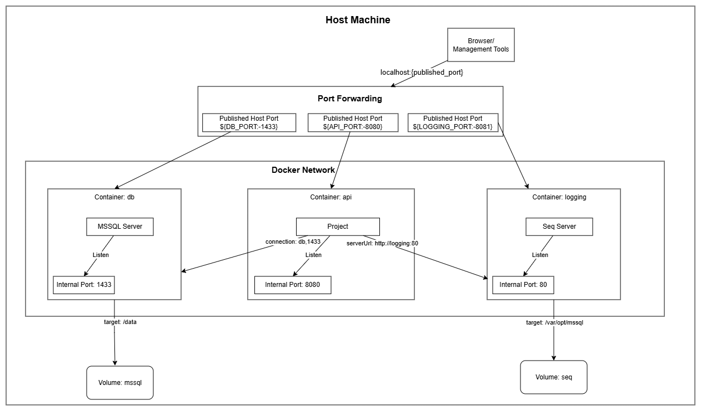

# Book Catalog Platform — Design Document

## Overview

Over the past four weeks, this platform grew from a simple single-entity in-memory prototype into a resilient, fully tested, containerized REST API backed by SQL Server.

This document tells the story of that month-long journey. It explains what the platform does today, how its architecture evolved week by week, the reasoning behind every major design choice, the lessons learned along the way, and what I would do differently if started again.

## 1. What the Platform Does

The **Book Catalog Platform** is a backend service for managing a modern library. It handles the full journey of books, library members, and physical lending

### Core Capabilities

- **Authors Management:**  Stores biographical records for authors who write the books in the catalog.
- **Book Catalog (Conceptual Titles):**  Catalogs book titles with rich metadata (Title, Genre, Price, Publication Date, and ISBN). Supports dynamic searching, price/date range filtering, multi-field sorting, and pagination.
- **Physical Inventory (Book Copies):**  Distinguishes between the book as an idea and the actual physical copies on library shelves, tracking each copy by its unique barcode.
- **User Accounts:**  Manages registered library users who can borrow books.
- **Lending & Loan Lifecycle:**  Manages the entire borrowing process. Users can borrow available physical copies, return them when finished, and view complete borrowing histories. The system strictly prevents double-borrowing of active copies.
- **Production-Grade Infrastructure:**  Built with structured logging (Serilog + Seq), transient error retries, health check endpoints, graceful shutdown, and containerized deployment with Docker.

### Summary of API Endpoints

#### 1. Authors (`/api/authors`)

| Method | Route | Description |
| :--- | :--- | :--- |
| `GET` | `/api/authors` | Get all authors (paginated) |
| `GET` | `/api/authors/{id}` | Get a single author by ID |
| `POST` | `/api/authors` | Create a new author |

#### 2. Books (`/api/books`)

| Method | Route | Description |
| :--- | :--- | :--- |
| `GET` | `/api/books` | Get books with pagination, filtering (by `Genre`, `Price` range, `PublicationDate` range), and sorting (by `Price`, `PublicationDate`, `Genre` in `Asc`/`Desc`) |
| `GET` | `/api/books/{id}` | Get a single book by ID |
| `POST` | `/api/books` | Create a new book |
| `PUT` | `/api/books/{id}` | Update an existing book |
| `DELETE` | `/api/books/{id}` | Delete a book only if any of it's copied not has active loans |

#### 3. Book Copies (`/api/book-copies`)

| Method | Route | Description |
| :--- | :--- | :--- |
| `GET` | `/api/book-copies` | Get all book copies (paginated) |
| `GET` | `/api/book-copies/{id}` | Get a single book copy by ID |
| `POST` | `/api/book-copies` | Create a new copy for a book with a unique barcode |

#### 4. Users (`/api/users`)

| Method | Route | Description |
| :--- | :--- | :--- |
| `GET` | `/api/users` | Get all users (paginated) |
| `GET` | `/api/users/{id}` | Get a user by ID |
| `POST` | `/api/users` | Create a new user |

#### 5. Loans (`/api/loans`)

| Method | Route | Description |
| :--- | :--- | :--- |
| `GET` | `/api/loans` | Get all loans across the library (paginated) |
| `GET` | `/api/loans/{id}` | Get loan details by ID |
| `GET` | `/api/loans/users/{userId}` | Get borrowing history for a specific user (paginated) |
| `GET` | `/api/loans/book-copies/{bookCopyId}` | Get loan history for a specific book copy (paginated) |
| `GET` | `/api/loans/books/{bookId}` | Get all loans across all copies of a book (paginated) |
| `POST` | `/api/loans` | Borrow a book copy |
| `PATCH` | `/api/loans/{id}` | Return a borrowed book copy |

#### 6. Health Check (`/healthz`)

| Method | Route | Description |
| :--- | :--- | :--- |
| `GET` | `/healthz/live` | Liveness check (is the process alive?) |
| `GET` | `/healthz/ready` | Readiness check (can it connect to the database?) |

---

### How the Solution Is Structured

```text
BookCatalog/
├── src/
│   └── BookCatalog.API/
│       ├── Controllers/        → Thin HTTP endpoints (AppController base for RFC 7807 problem details)
│       ├── Services/           → Business logic layer (implements use cases, orchestrates repository calls)
│       ├── Repositories/       → Data access abstractions (IBaseRepository<T>) & EF Core implementations
│       ├── Persistence/        → AppDbContext and fluent EF Core EntityTypeConfiguration classes
│       ├── Migrations/         → EF Core database schema migrations
│       ├── Entities/           → Domain models (Author, Book, BookCopy, User, Loan, BaseEntity)
│       ├── Dtos/               → Request/response contract models grouped by resource
│       ├── ExtensionMethods/   → Manual DTO mapping, pagination (ToPagedListAsync), query filters
│       ├── Utilities/          → Result<T>/Error pattern and ISBN normalizer
│       ├── Exceptions/         → GlobalExceptionHandler returning RFC 7807 ProblemDetails
│       ├── Logging/            → Serilog custom enrichers
│       ├── Options/            → Strongly-typed configuration options & startup validators (DatabaseOptions)
│       └── Program.cs          → DI setup, Serilog, health checks, resilience, graceful shutdown, pipeline
├── tests/
│   ├── BookCatalog.UnitTests/  → Isolated unit tests (Moq, MockQueryable, FluentAssertions, FakeTimeProvider)
│   │   ├── Services/           → Isolated service business logic tests
│   │   └── ExtensionMethods/   → Unit tests for DTO mappings and queryable extensions
│   └── BookCatalog.IntegrationTests/ → End-to-end integration tests (real HTTP against real SQL Server)
│       ├── Books/              → Book CRUD, filtering, sorting, and constraint integration tests
│       ├── Workflows/          → End-to-end borrowing and loan lifecycle workflow tests
│       └── Infrastructure/     → Testcontainers (SQL Server), Respawn, WebApplicationFactory fixture
├── docs/                       → System documentation, architecture decisions, ERD, and schema diagrams
├── Dockerfile                  → Multi-stage optimized production image build
└── docker-compose.yml          → Multi-container composition (API, SQL Server, and Seq logging)
```

---

## 2. Decisions I Made and Why

### 1. Layered Single-Project Architecture over Clean Architecture Overengineering

I was initially considering using Clean Architecture with CQRS (an approach I used in a previous project, [Chattr](https://github.com/ammar-gamal/Chattr)), but I felt this would be overengineering and introduce unnecessary complexity.

Instead, I chose a middle ground: a layered single project architecture so that migrating to full Clean Architecture later (if complexity grows) is straightforward. The interfaces are already in place, and the layers are already separated. If I ever need to extract `BookCatalog.Domain` or `BookCatalog.Infrastructure` into their own class libraries, the code is ready for it.

The core principle I kept from Clean Architecture is keeping business services free from direct infrastructure code. To achieve this, I strictly adhered to the **Dependency Inversion Principle (DIP)**. High-level modules (like `Controllers` and `Services`) do not depend on low-level modules (like concrete data access implementations). Instead, both depend on abstractions.

By abstracting data access through interfaces like `IBookRepository`, the application achieves loose coupling for dependency injection and straightforward unit testing. This is what will allow us to swap the in-memory storage for a real database later without modifying a single line of business logic.

This approach also gave me the advantage of keeping boundaries organized via namespaces and folders within a single project. It delivers most of the benefits of separation of concerns and testability, while avoiding the overhead of managing multiple project files and references.

The layers are split with a strict downward dependency flow (`Controllers -> Services -> Repositories`):

1. **Controllers (API Layer):** Extremely thin. They only handle HTTP requests/responses, routing, and map `Result` objects to HTTP status codes. No business logic lives here.
2. **Services (Business Logic Layer):** Contains all the core business rules and coordinates between input DTOs and Data Access.
3. **Repositories (Data Access Layer):** Handles the actual storage and retrieval of entities.

As the dependencies strictly flow downwards, each layer can be tested in isolation. For instance, the Service layer can be tested with mocked data repositories without needing a live database connection.

### 2. Generic Repository Pattern (`IBaseRepository<TEntity>`)

A generic base repository interface (`IBaseRepository<TEntity>`) and its implementations (`InMemoryBaseRepository<TEntity>` in Week 1–2, and `EFCoreBaseRepository<TEntity>` in Week 3) were introduced to handle standard data operations uniformly across all entities.

The reasoning:

- **Data Access Abstraction**: The repository provides an abstraction over storage and retrieval, keeping the service layer completely decoupled from underlying data-access technologies. This allowed swapping in-memory storage for EF Core / SQL Server with minimum changes to business logic (see Section 3 on `IQueryable<T>`).
- **DRY & Eliminating Boilerplate**: Standard operations (`AddAsync`, `GetByIdAsync`, `GetAll`, `UpdateAsync`, `DeleteAsync`, and `ExistsAsync`) are identical for any entity inheriting from `BaseEntity`. Implementing them once in a generic base eliminates repetitive boilerplate.
- **Focused Specific Repositories**: Specific interfaces like `IBookRepository` and `ILoanRepository` inherit all standard operations from `IBaseRepository` and focus exclusively on declaring domain-specific queries (such as `IsIsbnTakenAsync` or `BookHasActiveLoanAsync`).
- **Direct Usage for Simple Entities**: For entities that do not require custom queries (such as `Author` and `User`), business services inject `IBaseRepository<Author>` and `IBaseRepository<User>` directly, avoiding the need to create empty, redundant repository classes.

### 3. Returning `IQueryable<T>` from Repository (Pragmatism vs. Strict Abstraction)

The generic repository exposes `IQueryable<T>` via `GetAll()` rather than returning a pre-materialized `IEnumerable<T>` or `List<T>`.

This was an intentional architectural decision weighing **strict theoretical abstraction** against **real-world performance and maintainability**.

#### Why I Chose `IQueryable<T>`

1. **Deferred Execution & Database Evaluation**:
   The query is not executed immediately in memory. The service layer can dynamically compose filters (`ApplyFilters`), multi-field sorting, and pagination (`ToPagedListAsync`) so that SQL Server evaluates everything in a single, optimized SQL query on the database server. With `IEnumerable<T>`, data would be materialized, pulling far more records into memory than needed.
2. **Direct Projection to DTOs**:
   The service layer projects directly into DTOs via `.Select(BookToDtoProjection)`. SQL Server only reads and transfers the exact columns needed, reducing network payload and memory allocation.
3. **Preventing Repository Bloat**:
   Without `IQueryable<T>`, the repository would require dozens of custom query methods (`GetByGenreAsync`, `GetByPriceRangeAsync`, `GetFilteredAsync`,`GetSortedAsync`,`GetFilteredAndSortedAsync`...etc) to support every combination of UI filters. `IQueryable<T>` keeps the repository interface minimal and DRY.
4. **Pragmatism & YAGNI**:
   In real production systems, the underlying ORM/data source is rarely swapped. Over-abstracting the repository strictly to hide EF Core from the service layer would be a classic case of premature optimization.

#### The Trade-Offs (The Leaky Abstraction)

- **EF Core Coupling**: Returning `IQueryable<T>` is technically a leaky abstraction because the service layer becomes aware of data-access concerns.
- **Testing Complexity**: Unit testing queries requires mocking `IQueryable` async extensions, which I solved cleanly using the `MockQueryable.Moq` package.

#### Conclusion

While `IQueryable<T>` couples the service layer more tightly to EF Core query semantics, the benefits—query composition, dynamic filtering, server-side paging, and avoiding repository bloat outweigh the theoretical purity of a strict repository for this platform.

### 4. Removing Auto-Save from Repositories — Exposing `SaveChangesAsync` Explicitly

Previously, `AddAsync`, `UpdateAsync`, and `DeleteAsync` in `BaseRepository<TEntity>` each called `SaveChangesAsync` internally — every write committed to the database immediately on its own.

This was fine when each service method performed a single write, but it breaks down as soon as two writes need to be atomic. Each write would commit independently, meaning a failure midway could leave the database in a partially updated, inconsistent state.

**The fix:** `SaveChangesAsync(CancellationToken)` was added to `IBaseRepository<TEntity>` and its implementation in `BaseRepository<TEntity>`. Write methods no longer call it internally. Services call it explicitly once after all operations are staged in the EF Core change tracker:

```csharp
// Before — two independent commits if there were two writes:
await _loanRepository.Delete(loan, ct);         // commits immediately
await _bookCopyRepository.Delete(copy, ct);  // commits immediately

// After — one commit for both:
_loanRepository.Delete(loan);
_bookCopyRepository.Delete(copy);
await _loanRepository.SaveChangesAsync(ct);       // single commit
```

`Update` and `Delete` also became synchronous (`void`) — they only register changes in the EF Core change tracker, which is a local, in-memory operation with no async work to do.

**Why this approach over a separate `IUnitOfWork` interface:**

The classic solution is to introduce a dedicated `IUnitOfWork` interface wrapping the `DbContext` and exposing `SaveChangesAsync`. The drawback is that every service that performs writes would need an additional constructor dependency (`IUnitOfWork`) injected alongside its repositories.

Since all repositories in this app share the same scoped `AppDbContext`, calling `SaveChangesAsync` on *any one* of them commits all pending changes from all of them. Adding `SaveChangesAsync` to `IBaseRepository<TEntity>` achieves the same result with no new interfaces, no new DI registrations, and no extra constructor parameters in any service.

### 5. How I decided what to test and what not to test (Week 2)

**What I tested (Unit Testing):**
The core focus of my unit tests is the **Service Layer** (business logic). Because the architecture strictly adheres to the Dependency Inversion Principle, So i can easily mock dependencies (like `IBookRepository`) and test the business logic in complete isolation. This ensures that any future refactoring won't accidentally introduce unexpected bugs. I also tested pure utility classes and extension methods, as they have no external dependencies.

**What I did NOT test (at the unit level):**
I avoided writing unit tests for the **Repository Layer** (infrastructure code). Unit tests are meant to test specific units of logic independent of external dependencies. Testing the actual data source operations requires a live database, which falls under **Integration Testing**. Mocking the underlying data source to test a repository provides no real value, and testing it against a real database breaks the definition of an isolated unit test.

### 6. `TimeProvider` injected as a dependency

Rather than calling `DateTime.UtcNow` directly, `TimeProvider.System` is injected. This makes time controllable in tests — a unit test can pass a fake `TimeProvider` that returns a fixed date, making publication-year validation tests deterministic.

### 7. Sequential integer `Id` instead of `Guid`

Entities use an integer `Id` (`int`) instead of a `Guid`.

The reasoning is proactive database design for Week 3:

- In relational databases (e.g., SQL Server), the primary key typically acts as the **clustered index** which has it's own physical storage and the table is sorted based on it.
- Integer IDs are naturally appended at the end of the index, minimizing insertion overhead (unlike random Guids, which sometimes can cause page splits).
- Integer IDs are significantly smaller (4 bytes vs. 16 bytes for a Guid). This reduces the size of the index, allowing more entries to fit per page and improving the read/write performance.
- Integer IDs produce cleaner, more human-readable REST URLs (e.g., `/api/book/1` vs `/api/book/3fa85f64-5717-4562-b3fc-2c963f66afa6`).

### 8. Storing both Isbn and NormalizedIsbn

ISBNs can be submitted in various valid formats (e.g., with or without hyphens and spaces). The `NormalizedIsbn` field is generated via the `IsbnNormalizer` utility, which strips out hyphens and spaces, trims whitespace, and converts the string to uppercase.
This clean, normalized version is what the database uniqueness constraints and duplication checks run against, while the original `Isbn` is preserved to return back to the client exactly as they originally formatted it.

### 9. Manual DTO Mapping via Extension Methods

Instead of relying on third-party mapping libraries like AutoMapper or Mapster, all object mapping between Domain Entities and DTOs is handled explicitly through custom C# extension methods (located in the `ExtensionMethods/Mapping/` folder).
The reasoning behind this decision:

- **Performance & Zero Overhead**: Manual mapping is the fastest possible way to map objects in .NET. It avoids the startup penalty of building configuration dictionaries and the runtime overhead of reflection or expression tree compilation used by mapping libraries.
- **Compile-Time Safety & Refactoring**: When mapping is explicit, any change to an entity’s property name or type immediately breaks the build, alerting you to the issue. Implicit mapping libraries often hide these breakages until runtime.

### 10. `ConcurrentDictionary` for in-memory storage

Because we are storing our data in memory so the repository is registered as a **Singleton** — one shared instance for the lifetime of the app, which means all HTTP requests hit the same instance. Using a plain `Dictionary<TKey,TValue>` here would introduce a race condition and become not thread-safe.

`ConcurrentDictionary` handles concurrent reads and writes safely without requiring manual locks and ID generation is handled with `Interlocked.Increment`, which is also thread-safe.

### 11. `Result<T>` pattern instead of exceptions

Services return `Result<T>` objects rather than throwing exceptions for business-level failures like "book not found" or "ISBN already exists".

The reasoning: **exceptions are for unexpected failures, not expected outcomes**. A missing book is not an unexpected crash — it is a normal, predictable case. Throwing and catching exceptions for this wastes a call stack allocation.

With `Result<T>`, the controller always knows whether the operation succeeded or not, and maps the error to the right HTTP status code through `AppController.HandleError()`. This keeps error handling explicit, centralized, and readable.

Unhandled, truly unexpected exceptions (bugs, infrastructure failures) are caught by `GlobalExceptionHandler`, which logs them as critical and returns a safe `500 Internal Server Error` response — without leaking stack traces to the client.

### 12. Validation in two places — for different reasons

- **DataAnnotations on DTOs** (`[Required]`, `[MaxLength]`, `[Range]`) catch structurally invalid requests before they ever reach the service layer. ASP.NET Core's `[ApiController]` attribute rejects these automatically with a `400 Bad Request`.
- **Business rules in the service** (ISBN uniqueness, publication date must be in the past) live in `BookService`.

### 13. `AppController` base class

All controllers inherit `AppController`, which provides a single `HandleError(Result result)` method. This method translates an `Error` type into the correct `ProblemDetails` HTTP response (`404`, `409`, `400`, etc.). Without this, every controller action would repeat the same switch statement.

### 14. Consistent error response format

All errors — validation errors, not-found, conflicts, unhandled exceptions — return `ProblemDetails` (RFC 7807). Every error response includes `requestId` and `traceId` so errors can be correlated with logs.

### 15. Testcontainers + Respawn for Integration Testing

For integration testing, instead of using EF Core's in-memory provider or SQLite, tests run against a real Microsoft SQL Server container started automatically via `Testcontainers`. Between test runs, `Respawn` resets the tables in milliseconds

---

## 3. Week 3: Moving from In-Memory to a Relational Database with Entity Framework Core and Dockerization

### My Data Model and Why It Is Shaped This Way

The data model represents a library book catalog system. It is composed of five core entities: **Author**, **Book**, **BookCopy**, **User**, and **Loan**.

**ERD**


**Schema**


#### Why the Model Is Shaped This Way

1. **Separation of Conceptual Work (Book) vs. Physical Inventory (BookCopy)**

   The model explicitly separates the conceptual title (`Book`) from physical inventory (`BookCopy`):

   - **Metadata vs. Inventory:** Properties like `Title`, `Author`, `Genre`, and `ISBN` belong to the work itself and never change regardless of how many copies the library owns.
   - **Physical Tracking:** In a real library, physical copies have unique identifiers (`Barcode`).
   - **Individual Copy History:** Associating loans with `BookCopy` rather than `Book` allows the system to track the exact borrowing history of each individual physical item.

2. **Fully Auditable Loan Table**

   Rather than simply marking a `BookCopy` as "borrowed by User X," the `Loan` entity acts as a historical transaction log:

   - **Historical Record:** Past loans are never deleted; when a book is returned, `ReturnedDate` is set. This preserves the complete timeline of who borrowed what copy, when it was due, and when it was returned.
   - **Auditing & Late Tracking:** Having explicit timestamps (`LoanDate`, `DueDate`, `ReturnedDate`) makes it trivial to calculate overdue days and late fees (if applicable).

3. **Indexing Strategy**

   Indexing is heavily used to improve query performance and enforce critical business rules. Every foreign key is indexed — this matters for join performance, foreign key constraint checks, and improving queries that filter on the foreign key column.

   **Key indexes by table:**

   - **Loans**
     - **Unique filtered index on `BookCopyId WHERE ReturnedDate IS NULL`:** Enforces uniqueness only for active loans. This enforces the core domain rule at the database level — that a single copy can only be on a single active loan at any given time — preventing race conditions and double-borrowing without requiring manual transaction and handling concurrency conflicts.
     - **Note:** The filtered unique index on `BookCopyId` already provides an index usable for lookups over the *active* subset (`ReturnedDate IS NULL`). A separate non-filtered index on `BookCopyId` is still useful for queries spanning all loans (active + returned), such as full loan history for a book copy.

   - **Books**
     - **Individual indexes on `Genre`, `PublicationDate`, and `Price`:** Each column has its own index to optimize filtering and sorting operations.
     - **Unique index on `NormalizedIsbn`:** Ensures catalog uniqueness while preserving the original user-submitted ISBN format for display.

   - **BookCopies**
     - **Unique index on `Barcode`:** Ensures that every `Barcode` is unique across the entire inventory.

   - **Users**
     - **Unique index on `Email`:** Ensures that every `Email` is unique across all users.

### Which Database I Chose and Why

I chose SQL Server because my entire stack is Microsoft — .NET 10, EF Core, and I'm planning to deploy on Azure. Microsoft builds EF Core and SQL Server together, so the provider is first-party with tight integration — migrations, tooling, and debugging are all well supported and documented.

At the same time, EF Core keeps the application relatively database-agnostic. If I need to switch to another relational DBMS in the future, I can replace the SQL Server EF Core provider with the appropriate provider for the target database and update the database configuration and any database-specific code if necessary. This makes the migration easier without requiring major changes to the application's business logic or data-access abstractions.

### How Much of My Code Had to Change When I Replaced In-Memory Storage, and What That Says About Week 2

If we look strictly at the **storage mechanism swap** (moving from `ConcurrentDictionary` to EF Core / SQL Server): almost nothing in my business logic changed. However, because `IQueryable` is considered a leaky abstraction, and I returned `IQueryable` from the repository, `BookService` was forced to adapt how it executes queries:

1. **Async Query Execution**
   - Synchronous LINQ calls had to be rewritten to EF Core async extensions (`Count` → `CountAsync`, `ToList` → `ToListAsync`).

2. **Database Projections**
   - Instead of loading full entities from the database into the application, I added direct expression projections (`.Select(BookToDtoProjection)`) so queries translate efficiently to SQL instead of mapping in memory.

#### The Rest of the Changes Were Domain/Business Changes, Not Storage Changes

The remaining changes in `BookService` had nothing to do with EF Core replacing in-memory storage; they were new domain requirements:

- **Relational Author (`AuthorId`):** Adding a foreign key check (`await _authorRepository.ExistsAsync(request.AuthorId)`).
- **Loan business rules:** Adding a delete restriction (`await _loanRepository.BookHasActiveLoanAsync(id)`).
- **Property updates:** `PublicationYear` → `PublicationDate`.

The core orchestration — validating rules, calling repository methods (`AddAsync`, `UpdateAsync`, `DeleteAsync`), and returning `Result<T>` — remained identical.

#### What Does This Say About My Week 2 Design?

This transition is **proof that my Week 2 architecture worked exactly as intended**:

1. **Dependency Inversion Principle (DIP) Paid Off:** `BookService` never depended on `ConcurrentDictionary`, `List<T>`, or `InMemoryBookRepository`. It depended strictly on abstractions (`IBookRepository`, `IBaseRepository<T>`). Swapping the entire database engine was largely a matter of changing a single line in `Program.cs` (switching the DI registration from `InMemoryBookRepository` to `EfBookRepository` and change the lifetime to scoped).

2. **The `IQueryable<T>` Decision in Week 2 Was Validated:** In Week 2, I chose to return `IQueryable<T>` from `GetAll()` instead of concrete collections like `List<T>`. When moving to EF Core, my LINQ expressions, filters (`ApplyFilters`), and projections (`.Select()`) seamlessly translated to SQL queries evaluated on the database server, without restructuring the service layer — though, as discussed above, this did lead me to change the service code to use EF Core async extension methods.

### Where I Expect Performance to Become a Problem First

 1. **Every paginated list performs two database queries**  
    `ToPagedListAsync` always runs `CountAsync`, then a separate `Skip/Take` query. Also for deep pages  `SKIP`  becomes slower  because SQL Server must locate and discard earlier rows.

 2. **Sequential round trips in write workflows**  
    Most write operations perform multiple sequential existence checks (e.g., checking foreign key existence, checking barcode existence before insertion, ..etc) before saving. This primarily increases latency due to multiple round trips to the database and increases database connection usage.
This could be mitigated by relying on database constraints instead of performing explicit existence checks. However, this approach requires handling database constraint violations and translating the resulting database exceptions into appropriate application-level errors.

### What each meaningful line of my Dockerfile does

The `Dockerfile` employs a **multi-stage build** to keep the final production container small, secure, and fast to build:

```dockerfile

# Stage 1: Build & Publish

FROM mcr.microsoft.com/dotnet/sdk:10.0 AS publish

```

> Pulls the full .NET 10 SDK image containing the C# compiler, build tools, and CLI needed to compile the application. Names this build stage `publish`.

```dockerfile

WORKDIR /src

```

> Sets the working directory inside the container to `/src` for all subsequent build commands.

```dockerfile

COPY ["./src/BookCatalog.API/BookCatalog.API.csproj","./BookCatalog.API/"]

RUN dotnet restore "./BookCatalog.API/BookCatalog.API.csproj"

```

> **Layer Caching Optimization:** Copies *only* the project file first and runs `dotnet restore`. Docker caches this layer; unless dependencies in `.csproj` change, future builds skip package downloads entirely.

```dockerfile

COPY ["./src/","."]

```

> Copies the rest of the application source code into the build container.

```dockerfile

RUN dotnet publish -c release "./BookCatalog.API/BookCatalog.API.csproj" -o ./publish

```

> Compiles the application in `Release` mode with optimizations enabled and outputs the published binaries into the `./publish` directory.

---

```dockerfile

# Stage 2: Final Runtime Image

FROM mcr.microsoft.com/dotnet/aspnet:10.0 AS final

```

> Switches to a lightweight ASP.NET Core 10 runtime image. This image contains only what is needed to run the app—no compilers or SDK tools—significantly reducing the final image size and attack surface.

```dockerfile

WORKDIR /app

```

> Sets the working directory in the final image to `/app`.

```dockerfile

EXPOSE 8080

```

> Documents that the container listens on port 8080.

```dockerfile

COPY --from=publish /src/publish .

```

> Copies *only* the compiled binaries from the `publish` stage into the final image. (This is one of main benefits of multi-stage build, just copying what you want)

```dockerfile

ENTRYPOINT ["dotnet","BookCatalog.API.dll"]

```

> Configures the container to execute `dotnet BookCatalog.API.dll` when it starts up.

---

### Multi-Container Architecture & Networking (Docker Compose)

The application environment is fully containerized and orchestrated using Docker Compose across an isolated network, connecting the API to its dependencies:


#### Key Architectural Elements

- **Internal Docker Network:** Containers communicate via internal DNS names (`db:1433` for SQL Server, `logging:80` for Seq)
- **Port Forwarding:** Container ports are published to the host ports (`${API_PORT:-8080}`, `${DB_PORT:-1433}`, `${LOGGING_PORT:-8081}`) allowing external clients and management tools on the host to access the API, database, and logging server.
- **Persistent Volumes:** Data safety is preserved across container restarts using named volumes (`mssql` binded at `/var/opt/mssql` and `seq` binded at `/data`).

## 4. Architecture Evolution Across the Four Weeks

The system was developed iteratively over four weeks, shifting from basic correctness to maintainability, then persistence, and finally production readiness:

### Week 1: Core Foundation & In-Memory MVP

- **Focus**: Establishing the solution structure, basic domain entities, domain errors, and initial REST endpoints.
- **Implementation**:
  - Created domain entities (`Book`), DTO contracts, manual mapping extension methods.
  - Instead of using exceptions for expected business error, I implemented the `Result<T>` pattern and map the  business errors to the appropriate HTTP status codes and returning them as `ProblemDetails` through `AppController.HandleError()`.
  - Defined layered architecture inside a single project with strict downward dependency flow (`Controllers -> Services -> Repositories`).
  - Implemented Generic Repository Pattern (`InMemoryBaseRepository<T>`) using `ConcurrentDictionary<int, T>` with atomic ID generation via  `Interlocked.Increment` for thread-safe operations in a singleton lifetime.
  - Decided to return `IQueryable<T>` from repositories to support deferred execution and flexible filtering, sorting, and projection, while knowingly accepting the resulting leaky-abstraction trade-off.
  - Implemented `IBookService` that contain main business logic for book CRUD operations.

### Week 2: Pagination & Unit Testing

- **Focus**: Dynamic filtering, sorting, pagination, and robust unit testing.
- **Implementation**:
  - Implemented multi-field filtering (genre, price range, date range), dynamic sorting (ascending/descending), and server-side pagination (`ToPagedListAsync`).
  - Implemented comprehensive unit tests for  `BookService`, DTO mappers, and queryable extensions using  **xUnit**,  **Moq**, **FakeTimeProvider**, and  **FluentAssertions**.

### Week 3: Database Persistence and Containerization

- **Focus**: Replace in-memory storage with a persistent relational database, expand the library domain to real-world workflows and Docker support.
- **Implementation**:
  - Replaced the in-memory repository implementation with an **EF Core** `AppDbContext`**-based repository** backed by **Microsoft SQL Server**.
  - **Expanded the Domain Model:**  Separated the conceptual title (`Book`) from its physical items (`BookCopy`). Added  `Author`,  `User`, and  `Loan`  entities to model real borrowing and returning lifecycles.
  - During the migration from in-memory storage to EF Core, returning `IQueryable` from the repository exposed a **leaky abstraction**, requiring changes to `BookService` and the unit tests. Synchronous LINQ operations were replaced with EF Core asynchronous query extensions, and `MockQueryable.Moq` was introduced to support testing of `IQueryable`-based queries.

  - Utilized LINQ to filter entities at the database level and applied projections to map entities directly to DTOs
  - Containerized the application with a multi-stage `Dockerfile` (optimized for layer caching) and configured service orchestration with `docker-compose.yml`.

### Week 4: Integration Testing & Production Readiness

- **Focus**: Strengthening the application for production through integration testing,  configuration validation, resilience, and graceful shutdown.
- **Implementation**:
  - Refactored repository write operations to remove implicit saves from individual `Add`, `Update`, and `Delete` methods. Exposed `SaveChangesAsync` so the service layer can coordinate multiple repository operations and commit them atomically within a single transaction.
  - Implemented integration tests using `WebApplicationFactory`, `Testcontainers` with a real SQL Server instance, and `Respawn` for fast database resets between test runs.
  - Added structured logging using `Serilog` and added a `Seq` container to centralize, visualize, and query application logs.
  - Added fail-fast configuration validation using strongly typed `DatabaseOptions`, custom `IValidateOptions`, and `.ValidateOnStart()` to detect invalid or missing configuration during application startup.
  - Configured EF Core `EnableRetryOnFailure` with to handle transient database connectivity failures.
  - Implemented graceful shutdown by configuring Kestrel's `ShutdownTimeout`, Docker Compose's `stop_grace_period`, and cancellation token propagation to allow in-flight requests to complete cleanly or cancel the operation by the token.
  - Added separate liveness and readiness health probes: `/healthz/live` for process health and `/healthz/ready` for dependency health, particularly SQL Server availability.

---

## 5. What I Would Do Differently If I Started Again

Reflecting on the month-long development cycle, several architectural patterns could be improved if rebuilding from scratch:

### 1. Rich Domain Model (DDD Entities) Instead of Anemic Domain Models

- **Current State:** Domain entities (`Book`, `Loan`, `BookCopy`) are primarily anemic data holders with public getters and setters. Business invariants (such as checking whether a loan is already returned, or setting return timestamps) are orchestrated inside `LoanService` and `BookService`.
- **Alternative:** Encapsulate business logic directly within the entities (e.g., `loan.Return(returnDate)` and `copy.MarkAsBorrowed()`). Making entity property setters private and exposing domain methods would ensure that an entity can never exist in an invalid state, regardless of which service manipulates it.

### 2. Database Constraints Instead of Application-Level Existence Checks

- **Current State:** Write operations perform sequential checks (e.g., `await _authorRepository.ExistsAsync(authorId)` and `await _bookRepository.IsIsbnTakenAsync(isbn)`) before executing inserts or updates.
- **Alternative:** Under high write concurrency, sequential checks introduce extra network round-trips and still suffer from race conditions between check and insert.  This could be mitigated by relying on database constraints instead of performing explicit existence checks. However, this approach requires handling database constraint violations and translating the resulting database exceptions into appropriate application-level errors.

### 3. Vertical Slice Architecture / CQRS for Query Separation

- **Current State:** Standard three-layer architecture (`Controller -> Service -> Repository`).
- **Alternative:** While this was the right decision to avoid initial overengineering, as queries become more specialized (e.g., historical loan reporting by book copy, user borrowing stats), vertical slices using MediatR would allow write commands and complex read queries to be handled independently. Read handlers could query the database using Dapper, which can be more performant than EF Core since it executes raw SQL directly.

### 4. Use `IAppDbContext` Directly Instead of the Repository Pattern

- **Current State:** The application uses custom repository abstractions (`IBaseRepository<T>`, `IBookRepository`) on top of EF Core. While these provide a layer of abstraction, they also introduce additional indirection and boilerplate. The need to expose `IQueryable<T>` for dynamic filtering, sorting, pagination, and projection also reduces the value of the abstraction.
- **Alternative:** Inject `IAppDbContext` directly into the application services and use EF Core's `DbSet<T>` for data access. Since `DbContext` already implements the Unit of Work pattern and `DbSet<T>` provides repository-like functionality, removing the custom repository layer would simplify the architecture, reduce boilerplate, and allow queries to take full advantage of EF Core's capabilities.

---

## 6. Known Limitations & What Would Break First Under Load

Being honest about system bottlenecks is critical for production defense:

### 1. The Two-Query Pagination Bottleneck (Breaks First)

`ToPagedListAsync` always runs `CountAsync`, then a separate `Skip/Take` query to retrieve the requested page. This means every paginated request requires **two database round trips**, adding unnecessary latency. Additionally, `Skip/Take` becomes increasingly expensive for deep pages because SQL Server must locate and discard earlier rows.

### 2. Multi-RT Database Existence Checks (Latency Spike)

  Most write operations perform multiple sequential existence checks (e.g., checking foreign key existence, checking barcode existence before insertion, ..etc) before saving. This primarily increases latency due to multiple round trips to the database and the chance for Check-Then-Act race condition.
This could be mitigated by relying on database constraints instead of performing explicit existence checks. However, this approach requires handling database constraint violations and translating the resulting database exceptions into appropriate application-level errors.

---

## 7. What I Learned That I Did Not Know a Month Ago

### 1. Integration Testing Against Real Dependencies

Previously, I thought integration testing often meant choosing between two options: in-memory databases, which can hide real database behavior and constraints, or shared test databases, which can suffer from data pollution and test interference. I learned to combine **Testcontainers** to spin up real SQL Server instances in Docker, **Respawn** to quickly reset the database between tests, and **WebApplicationFactory** to run the application in an in-memory test server significantly improved my testing workflow.

### 2. Production Readiness

I learned that production readiness is not just about writing clean code; it requires considering the entire operational lifecycle. Production systems operate in environments where networks can fail, containers can restart unexpectedly, and configuration can be invalid. Writing reliable software means anticipating these scenarios by using bounded exponential-backoff retries with jitter for transient failures, validating critical configuration at startup, using circuit breakers when communicating with external services to prevent cascading failures, and implementing graceful shutdowns through ASP.NET Core's `HostOptions.ShutdownTimeout` to allow in-flight requests to complete before the application stops.

### 3. Structured Logging

   I learned that structured logging is about turning log output into machine-queryable data rather than plain text. Enriching logs with information such as `TraceId` makes troubleshooting much easier for example, debugging a failed request at 3 AM a matter of a single query in Seq rather than searching through thousands of unindexed text files.

### 4. The Pragmatism of Leaky Abstractions

   Pure architectural theory often says that repositories must completely encapsulate data access. In practice, a pragmatic solution like returning `IQueryable<T>` allows database engines to do what they do best (filtering, sorting, projecting, and paging in a single SQL round trip) without requiring hundreds of specialized repository methods.
