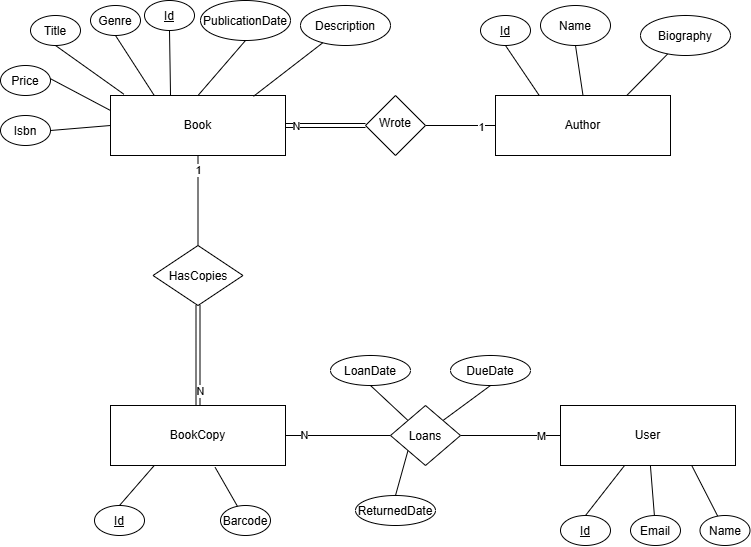
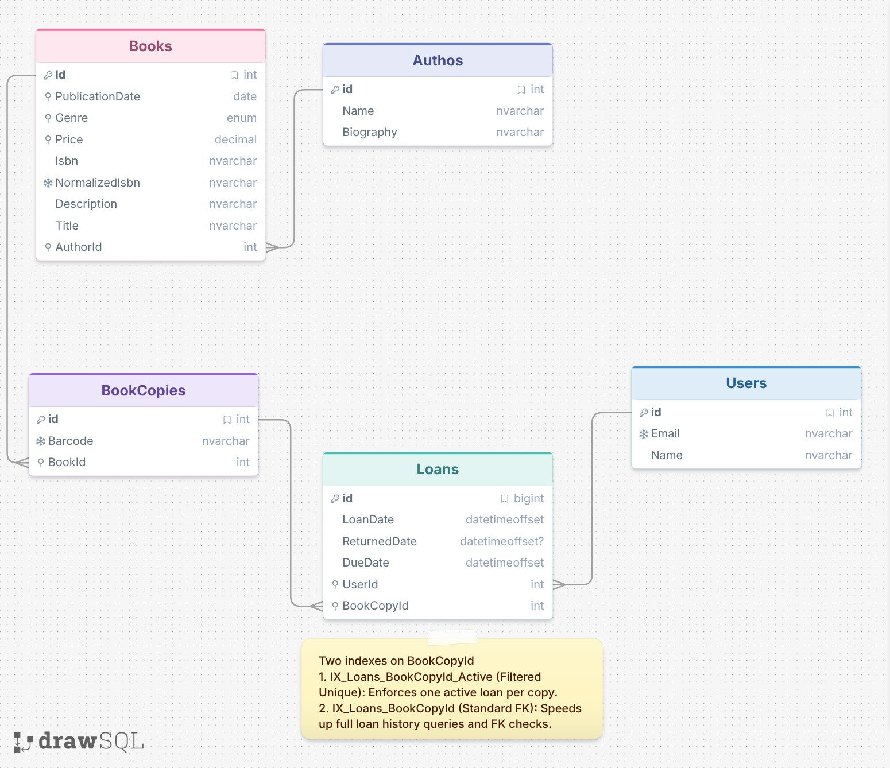

# Book Catalog Platform — Design Document

## What I Built

A comprehensive REST API for a **Book Catalog Platform**, built with **ASP.NET Core (.NET 10)**, **Entity Framework Core 10**, and **SQL Server**.

The system manages authors, books, book copies, user accounts, the full borrowing/returning lifecycle via loans and history of all loans.

## API Endpoints

### 1. Authors (`/api/authors`)
| Method | Route | Description |
| :--- | :--- | :--- |
| `GET` | `/api/authors` | Get all authors (paginated) |
| `GET` | `/api/authors/{id}` | Get a single author by ID |
| `POST` | `/api/authors` | Create a new author |
### 2. Books (`/api/books`)
| Method | Route | Description |
| :--- | :--- | :--- |
| `GET` | `/api/books` | Get books with pagination, filtering (by `Genre`, `Price` range, `PublicationDate` range), and sorting (by `Price`, `PublicationDate`, `Genre` in `Asc`/`Desc`) |
| `GET` | `/api/books/{id}` | Get a single book by ID |
| `POST` | `/api/books` | Create a new book  |
| `PUT` | `/api/books/{id}` | Update an existing book |
| `DELETE` | `/api/books/{id}` | Delete a book |
### 3. Book Copies (`/api/book-copies`)
| Method | Route | Description |
| :--- | :--- | :--- |
| `GET` | `/api/book-copies` | Get all book copies (paginated) |
| `GET` | `/api/book-copies/{id}` | Get a single book copy by ID |
| `POST` | `/api/book-copies` | Create a new copy for a book with a unique barcode |
### 4. Users (`/api/users`)
| Method | Route | Description |
| :--- | :--- | :--- |
| `GET` | `/api/users` | Get all users (paginated) |
| `GET` | `/api/users/{id}` | Get a user by ID |
| `POST` | `/api/users` | Create a new user |
### 5. Loans (`/api/loans`)
| Method | Route | Description |
| :--- | :--- | :--- |
| `GET` | `/api/loans` | Get all loans across the library (paginated) |
| `GET` | `/api/loans/{id}` | Get loan details by ID |
| `GET` | `/api/loans/users/{userId}` | Get borrowing history for a specific user (paginated) |
| `GET` | `/api/loans/book-copies/{bookCopyId}` | Get loan history for a specific book copy (paginated) |
| `GET` | `/api/loans/books/{bookId}` | Get all loans across all copies of a book (paginated) |
| `POST` | `/api/loans` | Borrow a book copy  |
| `PATCH` | `/api/loans/{id}` | Return a borrowed book copy |

---

## How the Solution Is Structured

```text
BookCatalog/
├── src/
│   └── BookCatalog.API/
│       ├── Controllers/        → Thin HTTP boundary (status code mapping via AppController)
│       ├── Services/           → Business rules
│       ├── Repositories/       → Data access abstractions & implementations
│       ├── Persistence/        → AppDbContext and fluent EF Core EntityTypeConfiguration classes
│       ├── Migrations/         → EF Core database migrations
│       ├── Entities/           → Domain models
│       ├── Dtos/               → Contract models grouped by resource (Author, Book, Loan, etc.)
│       ├── ExtensionMethods/   → DTO mapping, pagination (ToPagedListAsync), query filters
│       ├── Utilities/          → Result<T>/Error pattern, ISBN normalizer
│       ├── Exceptions/         → Global exception handler
│       └── Program.cs          → DI container registration, middleware, and auto-migration
├── tests/
│   ├── BookCatalog.UnitTests/  → Isolated unit tests with Moq, MockQueryable, FluentAssertions, FakeTimeProvider
│   └── BookCatalog.IntegrationTests/ → End-to-end integration tests
├── docs/                       → System documentation and architecture decisions
├── Dockerfile                  → Multi-stage image build
└── docker-compose.yml          → Defines and manages the API and SQL Server services
```

---

## Decisions I Made and Why

### 1. Layered Single-Project Architecture over Clean Architecture Overengineering (Week-2)

I was initially considering using Clean Architecture with CQRS (an approach I used in a previous project, [Chattr](https://github.com/ammar-gamal/Chattr)), but I felt this would be overengineering and introduce unnecessary complexity.

Instead, I chose a middle ground: a layered single project architecture so that migrating to full Clean Architecture later (if complexity grows) is straightforward. The interfaces are already in place, and the layers are already separated. If I ever need to extract `BookCatalog.Domain` or `BookCatalog.Infrastructure` into their own class libraries, the code is ready for it.

The core principle I kept from Clean Architecture is keeping business services free from direct infrastructure code. To achieve this, I strictly adhered to the **Dependency Inversion Principle (DIP)**. High-level modules (like `Controllers` and `Services`) do not depend on low-level modules (like concrete data access implementations). Instead, both depend on abstractions.

By abstracting data access through interfaces like `IBookRepository`, the application achieves loose coupling for dependency injection and straightforward unit testing. This is what will allow us to swap the in-memory storage for a real database later without modifying a single line of business logic.

This approach also gave me the advantage of keeping boundaries organized via namespaces and folders within a single project. It delivers most of the benefits of separation of concerns and testability, while avoiding the overhead of managing multiple project files and references.

The layers are split with a strict downward dependency flow (`Controllers -> Services -> Repositories`):

1. **Controllers (API Layer):** Extremely thin. They only handle HTTP requests/responses, routing, and map `Result` objects to HTTP status codes. No business logic lives here.
2. **Services (Business Logic Layer):** Contains all the core business rules and coordinates between input DTOs and Data Access.
3. **Repositories (Data Access Layer):** Handles the actual storage and retrieval of entities.

As the dependencies strictly flow downwards, each layer can be tested in isolation. For instance, the Service layer can be tested with mocked data repositories without needing a live database connection.

### 2. Generic Repository Pattern (`IBaseRepository<TEntity>`) (Week 2)

A generic base repository interface (`IBaseRepository<TEntity>`) and its implementations (`InMemoryBaseRepository<TEntity>` in Week 1–2, and `EFCoreBaseRepository<TEntity>` in Week 3) were introduced to handle standard data operations uniformly across all entities.

The reasoning:
- **Data Access Abstraction**: The repository provides an abstraction over storage and retrieval, keeping the service layer completely decoupled from underlying data-access technologies. This allowed swapping in-memory storage for EF Core / SQL Server with minimum changes to business logic (see Section 3 on `IQueryable<T>`).
- **DRY & Eliminating Boilerplate**: Standard operations (`AddAsync`, `GetByIdAsync`, `GetAll`, `UpdateAsync`, `DeleteAsync`, and `ExistsAsync`) are identical for any entity inheriting from `BaseEntity`. Implementing them once in a generic base eliminates repetitive boilerplate.
- **Focused Specific Repositories**: Specific interfaces like `IBookRepository` and `ILoanRepository` inherit all standard operations from `IBaseRepository` and focus exclusively on declaring domain-specific queries (such as `IsIsbnTakenAsync` or `BookHasActiveLoanAsync`).
- **Direct Usage for Simple Entities**: For entities that do not require custom queries (such as `Author` and `User`), business services inject `IBaseRepository<Author>` and `IBaseRepository<User>` directly, avoiding the need to create empty, redundant repository classes.

### 3. Returning `IQueryable<T>` from Repository (Pragmatism vs. Strict Abstraction) (Week 2/3)

The generic repository exposes `IQueryable<T>` via `GetAll()` rather than returning a pre-materialized `IEnumerable<T>` or `List<T>`. 

This was an intentional architectural decision weighing **strict theoretical abstraction** against **real-world performance and maintainability**.

#### Why I Chose `IQueryable<T>`: 

1. **Deferred Execution & Database Evaluation**: 
   The query is not executed immediately in memory. The service layer can dynamically compose filters (`ApplyFilters`), multi-field sorting, and pagination (`ToPagedListAsync`) so that SQL Server evaluates everything in a single, optimized SQL query on the database server. With `IEnumerable<T>`, data would be materialized , pulling far more records into memory than needed.
2. **Direct Projection to DTOs**: 
   The service layer projects directly into DTOs via `.Select(BookToDtoProjection)`. SQL Server only reads and transfers the exact columns needed, reducing network payload and memory allocation.
3. **Preventing Repository Bloat**: 
   Without `IQueryable<T>`, the repository would require dozens of custom query methods (`GetByGenreAsync`, `GetByPriceRangeAsync`, `GetFilteredAsync`,`GetSortedAsync`,`GetFilteredAndSortedAsync`...etc) to support every combination of UI filters. `IQueryable<T>` keeps the repository interface minimal and DRY.
4. **Pragmatism & YAGNI**: 
   In real production systems, the underlying ORM/data source is rarely swapped. Over-abstracting the repository strictly to hide EF Core from the service layer would be a classic case of premature optimization (Which is the root of all evil. :D)

#### The Trade-Offs (The Leaky Abstraction):

- **EF Core Coupling**: Returning `IQueryable<T>` is technically a leaky abstraction because the service layer becomes aware of data-access concerns.
- **Testing Complexity**: Unit testing queries requires mocking `IQueryable` async extensions, which I solved cleanly using the `MockQueryable.Moq` package.

#### Conclusion:
While `IQueryable<T>` couples the service layer more tightly to EF Core query semantics, the benefits—query composition, dynamic filtering, server-side paging, and avoiding repository bloat outweigh the theoretical purity of a strict repository for this platform.


### 4. How I decided what to test and what not to test (Week 2)

**What I tested (Unit Testing):**
The core focus of my unit tests is the **Service Layer** (business logic). Because the architecture strictly adheres to the Dependency Inversion Principle, So i can easily mock dependencies (like `IBookRepository`) and test the business logic in complete isolation. This ensures that any future refactoring won't accidentally introduce unexpected bugs. I also tested pure utility classes and extension methods, as they have no external dependencies.

**What I did NOT test (at the unit level):**
I avoided writing unit tests for the **Repository Layer** (infrastructure code). Unit tests are meant to test specific units of logic independent of external dependencies. Testing the actual data source operations requires a live database, which falls under **Integration Testing**. Mocking the underlying data source to test a repository provides no real value, and testing it against a real database breaks the definition of an isolated unit test.

### 5. `TimeProvider` injected as a dependency

Rather than calling `DateTime.UtcNow` directly, `TimeProvider.System` is injected. This makes time controllable in tests — a unit test can pass a fake `TimeProvider` that returns a fixed date, making publication-year validation tests deterministic.


### 6. Sequential integer `Id` instead of `Guid`

Entities use an integer `Id` (`int`) instead of a `Guid`.

The reasoning is proactive database design for Week 3:

- In relational databases (e.g., SQL Server), the primary key typically acts as the **clustered index** which has it's own physical storage and the table is sorted based on it.
- Integer IDs are naturally appended at the end of the index, minimizing insertion overhead (unlike random Guids, which sometimes can cause page splits).
- Integer IDs are significantly smaller (4 bytes vs. 16 bytes for a Guid). This reduces the size of the index, allowing more entries to fit per page and improving the read/write performance.
- Integer IDs produce cleaner, more human-readable REST URLs (e.g., `/api/book/1` vs `/api/book/3fa85f64-5717-4562-b3fc-2c963f66afa6`).

### 7. Storing both Isbn and NormalizedIsbn

ISBNs can be submitted in various valid formats (e.g., with or without hyphens and spaces). The `NormalizedIsbn` field is generated via the `IsbnNormalizer` utility, which strips out hyphens and spaces, trims whitespace, and converts the string to uppercase. 
This clean, normalized version is what the database uniqueness constraints and duplication checks run against, while the original `Isbn` is preserved to return back to the client exactly as they originally formatted it

### 8. Manual DTO Mapping via Extension Methods 

Instead of relying on third-party mapping libraries like AutoMapper or Mapster, all object mapping between Domain Entities and DTOs is handled explicitly through custom C# extension methods (located in the `ExtensionMethods/Mapping/` folder).
The reasoning behind this decision:
- **Performance & Zero Overhead**: Manual mapping is the fastest possible way to map objects in .NET. It avoids the startup penalty of building configuration dictionaries and the runtime overhead of reflection or expression tree compilation used by mapping libraries.
- **Compile-Time Safety & Refactoring**: When mapping is explicit, any change to an entity’s property name or type immediately breaks the build, alerting you to the issue. Implicit mapping libraries often hide these breakages until runtime.

### 9. `ConcurrentDictionary` for in-memory storage

Because we are storing our data in memory so the repository is registered as a **Singleton** — one shared instance for the lifetime of the app, which means all HTTP requests hit the same instance. Using a plain `Dictionary<TKey,TValue>` here would introduce a race condition and become not thread-safe.

`ConcurrentDictionary` handles concurrent reads and writes safely without requiring manual locks and ID generation is handled with `Interlocked.Increment`, which is also thread-safe.


### 10. `Result<T>` pattern instead of exceptions

Services return `Result<T>` objects rather than throwing exceptions for business-level failures like "book not found" or "ISBN already exists".

The reasoning: **exceptions are for unexpected failures, not expected outcomes**. A missing book is not an unexpected crash — it is a normal, predictable case. Throwing and catching exceptions for this wastes a call stack allocation.

With `Result<T>`, the controller always knows whether the operation succeeded or not, and maps the error to the right HTTP status code through `AppController.HandleError()`. This keeps error handling explicit, centralized, and readable.

Unhandled, truly unexpected exceptions (bugs, infrastructure failures) are caught by `GlobalExceptionHandler`, which logs them as critical and returns a safe `500 Internal Server Error` response — without leaking stack traces to the client.

### 11. Validation in two places — for different reasons

- **DataAnnotations on DTOs** (`[Required]`, `[MaxLength]`, `[Range]`) catch structurally invalid requests before they ever reach the service layer. ASP.NET Core's `[ApiController]` attribute rejects these automatically with a `400 Bad Request`.
- **Business rules in the service** (ISBN uniqueness, publication date must be in the past) live in `BookService`.

### 12. `AppController` base class

All controllers inherit `AppController`, which provides a single `HandleError(Result result)` method. This method translates an `Error` type into the correct `ProblemDetails` HTTP response (`404`, `409`, `400`, etc.). Without this, every controller action would repeat the same switch statement.

### 13. Consistent error response format

All errors — validation errors, not-found, conflicts, unhandled exceptions — return `ProblemDetails` (RFC 7807). Every error response includes `requestId` and `traceId` so errors can be correlated with logs.


---

## What was painful to change from week 1, and what that tells you about my original design

Honestly, I didn’t have to make any significant changes when I started unit testing in Week 2. From the beginning, I followed a layered architecture and used the Repository Pattern, which kept my business logic separated from the data access layer

---
## Week 3: Moving from In-Memory to a Relational Database with Entity Framework Core and Dockerization

### My Data Model and Why It Is Shaped This Way

The data model represents a library book catalog system. It is composed of five core entities: **Author**, **Book**, **BookCopy**, **User**, and **Loan**.

**ERD**



**Schema**



#### Why the Model Is Shaped This Way

1. **Separation of Conceptual Work (Book) vs. Physical Inventory (BookCopy)**

   The model explicitly separates the conceptual title (`Book`) from physical inventory (`BookCopy`):

   - **Metadata vs. Inventory:** Properties like `Title`, `Author`, `Genre`, and `ISBN` belong to the work itself and never change regardless of how many copies the library owns.
   - **Physical Tracking:** In a real library, physical copies have unique identifiers (`Barcode`).
   - **Individual Copy History:** Associating loans with `BookCopy` rather than `Book` allows the system to track the exact borrowing history of each individual physical item.

2. **Fully Auditable Loan Table**

   Rather than simply marking a `BookCopy` as "borrowed by User X," the `Loan` entity acts as a historical transaction log:

   - **Historical Record:** Past loans are never deleted; when a book is returned, `ReturnedDate` is set. This preserves the complete timeline of who borrowed what copy, when it was due, and when it was returned.
   - **Auditing & Late Tracking:** Having explicit timestamps (`LoanDate`, `DueDate`, `ReturnedDate`) makes it trivial to calculate overdue days and late fees (if applicable).

3. **Indexing Strategy**

   Indexing is heavily used to improve query performance and enforce critical business rules. Every foreign key is indexed — this matters for join performance, foreign key constraint checks, and improving queries that filter on the foreign key column.

   **Key indexes by table:**

   - **Loans**
     - **Unique filtered index on `BookCopyId WHERE ReturnedDate IS NULL`:** Enforces uniqueness only for active loans. This enforces the core domain rule at the database level — that a single copy can only be on a single active loan at any given time — preventing race conditions and double-borrowing without requiring manual transaction and handling concurrency conflicts .
     - **Note:** The filtered unique index on `BookCopyId` already provides an index usable for lookups over the *active* subset (`ReturnedDate IS NULL`). A separate non-filtered index on `BookCopyId` is still useful for queries spanning all loans (active + returned), such as full loan history for a book copy.

   - **Books**
     - **Individual indexes on `Genre`, `PublicationDate`, and `Price`:** Each column has its own index to optimize filtering and sorting operations.
     - **Unique index on `NormalizedIsbn`:** Ensures catalog uniqueness while preserving the original user-submitted ISBN format for display.

   - **BookCopies**
     - **Unique index on `Barcode`:** Ensures that every `Barcode` is unique across the entire inventory.

   - **Users**
     - **Unique index on `Email`:** Ensures that every `Email` is unique across all users.


### Which Database I Chose and Why

I chose SQL Server because my entire stack is Microsoft — .NET 10, EF Core, and I'm planning to deploy on Azure. Microsoft builds EF Core and SQL Server together, so the provider is first-party with tight integration — migrations, tooling, and debugging are all well supported and documented.

At the same time, EF Core keeps the application relatively database-agnostic. If I need to switch to another relational DBMS in the future, I can replace the SQL Server EF Core provider with the appropriate provider for the target database and update the database configuration and any database-specific code if necessary. This makes the migration easier without requiring major changes to the application's business logic or data-access abstractions.


### How Much of My Code Had to Change When I Replaced In-Memory Storage, and What That Says About Week 2

If we look strictly at the **storage mechanism swap** (moving from `ConcurrentDictionary` to EF Core / SQL Server): almost nothing in my business logic changed. However, because `IQueryable` is considered a leaky abstraction, and I returned `IQueryable` from the repository, `BookService` was forced to adapt how it executes queries:

1. **Async Query Execution**
   - Synchronous LINQ calls had to be rewritten to EF Core async extensions (`Count` → `CountAsync`, `ToList` → `ToListAsync`).

2. **Database Projections**
   - Instead of loading full entities from the database into the application, I added direct expression projections (`.Select(BookToDtoProjection)`) so queries translate efficiently to SQL instead of mapping in memory.

#### The Rest of the Changes Were Domain/Business Changes, Not Storage Changes
The remaining changes in `BookService` had nothing to do with EF Core replacing in-memory storage; they were new domain requirements:

- **Relational Author (`AuthorId`):** Adding a foreign key check (`await _authorRepository.ExistsAsync(request.AuthorId)`).
- **Loan business rules:** Adding a delete restriction (`await _loanRepository.BookHasActiveLoanAsync(id)`).
- **Property updates:** `PublicationYear` → `PublicationDate`.

The core orchestration — validating rules, calling repository methods (`AddAsync`, `UpdateAsync`, `DeleteAsync`), and returning `Result<T>` — remained identical.

#### What Does This Say About My Week 2 Design?

This transition is **proof that my Week 2 architecture worked exactly as intended**:

1. **Dependency Inversion Principle (DIP) Paid Off:** `BookService` never depended on `ConcurrentDictionary`, `List<T>`, or `InMemoryBookRepository`. It depended strictly on abstractions (`IBookRepository`, `IBaseRepository<T>`). Swapping the entire database engine was largely a matter of changing a single line in `Program.cs` (switching the DI registration from `InMemoryBookRepository` to `EfBookRepository`).

2. **The `IQueryable<T>` Decision in Week 2 Was Validated:** In Week 2, I chose to return `IQueryable<T>` from `GetAll()` instead of concrete collections like `List<T>`. When moving to EF Core, my LINQ expressions, filters (`ApplyFilters`), and projections (`.Select()`) seamlessly translated to SQL queries evaluated on the database server, without restructuring the service layer — though, as discussed above, this did lead me to change the service code to use EF Core async extension methods.


### Where I Expect Performance to Become a Problem First
 1.  **Every paginated list performs two database queries**  
    `ToPagedListAsync` always runs `CountAsync`, then a separate `Skip/Take` query. Also for deep pages  `SKIP`  becomes slower  because SQL Server must locate and discard earlier rows.
    
 2.   **Serialized round trips in write workflows**  
    Most write operations perform multiple sequential existence checks (e.g., checking foreign key existence, checking barcode existence before insertion, ..etc) before saving. This primarily increases latency due to multiple round trips to the database and increases database connection usage.
This could be mitigated by relying on database constraints instead of performing explicit existence checks. However, this approach requires handling database constraint violations and translating the resulting database exceptions into appropriate application-level errors.

    
###  What each meaningful line of my Dockerfile does


The `Dockerfile` employs a **multi-stage build** to keep the final production container small, secure, and fast to build:

```dockerfile

# Stage 1: Build & Publish

FROM mcr.microsoft.com/dotnet/sdk:10.0 AS publish

```

> Pulls the full .NET 10 SDK image containing the C# compiler, build tools, and CLI needed to compile the application. Names this build stage `publish`.

```dockerfile

WORKDIR /src

```

> Sets the working directory inside the container to `/src` for all subsequent build commands.

```dockerfile

COPY ["./src/BookCatalog.API/BookCatalog.API.csproj","./BookCatalog.API/"]

RUN dotnet restore "./BookCatalog.API/BookCatalog.API.csproj"

```

>  **Layer Caching Optimization:** Copies *only* the project file first and runs `dotnet restore`. Docker caches this layer; unless dependencies in `.csproj` change, future builds skip package downloads entirely.

```dockerfile

COPY ["./src/","."]

```

> Copies the rest of the application source code into the build container.

```dockerfile

RUN dotnet publish -c release "./BookCatalog.API/BookCatalog.API.csproj" -o ./publish

```

> Compiles the application in `Release` mode with optimizations enabled and outputs the published binaries into the `./publish` directory.

---

```dockerfile

# Stage 2: Final Runtime Image

FROM mcr.microsoft.com/dotnet/aspnet:10.0 AS final

```

> Switches to a lightweight ASP.NET Core 10 runtime image. This image contains only what is needed to run the app—no compilers or SDK tools—significantly reducing the final image size and attack surface.

```dockerfile

WORKDIR /app

```

> Sets the working directory in the final image to `/app`.

```dockerfile

EXPOSE 8080

```

> Documents that the container listens on port 8080.

```dockerfile

COPY --from=publish /src/publish .

```

> Copies *only* the compiled binaries from the `publish` stage into the final image. (This is one of main benefits of multi-stage build, just copying what you want)

```dockerfile

ENTRYPOINT ["dotnet","BookCatalog.API.dll"]

```

> Configures the container to execute `dotnet BookCatalog.API.dll` when it starts up.